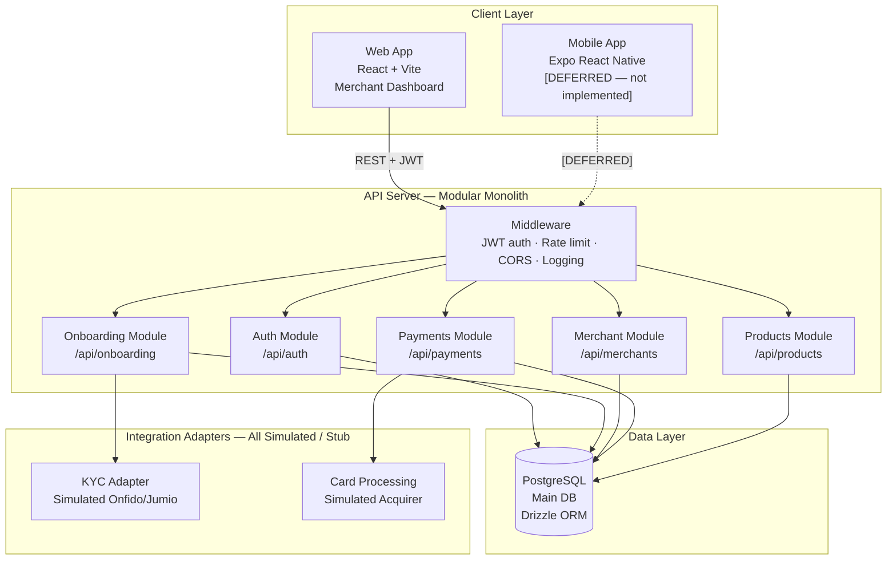
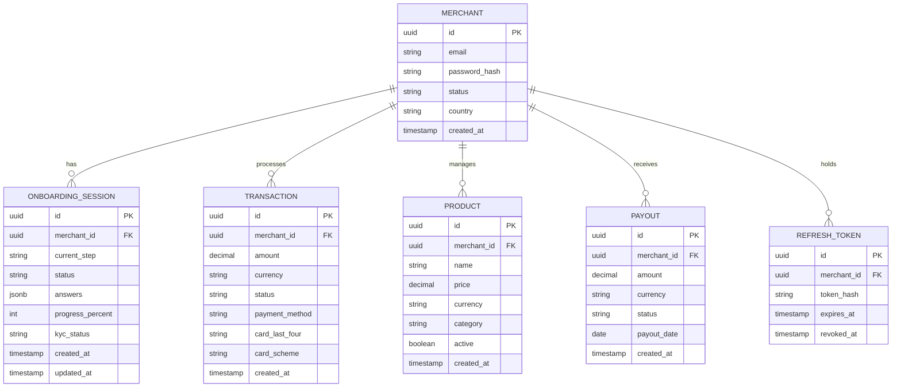
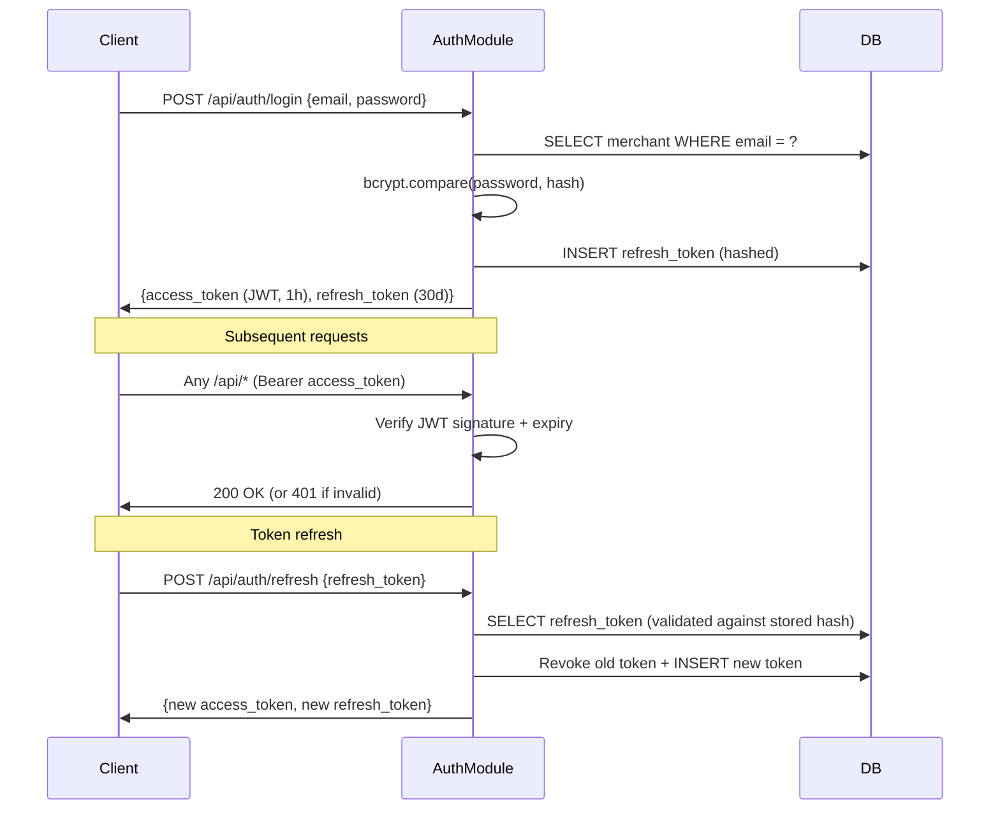
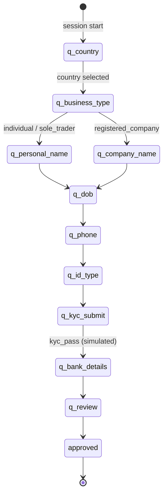

# System Architecture

## Overview

PayOS is a SumUp-inspired payments reference system implemented as a **modular monolith**. The backend is a single Express 5 process with route modules for auth, onboarding, merchants, payments, and products — not separate deployed microservices.

All business logic is simulated/mocked — no real card processing, no real KYC provider.

> **Mobile app:** NOT implemented in this repository. Marked as deferred. See `docs/architecture/mobile-plan.md` for the intended design.

---

## Architecture Diagram (Mermaid)

---

## Module Responsibilities

All modules run in a single Express 5 process (`artifacts/api-server`).

### Middleware stack (applied globally)
- JWT validation (Bearer token)
- Auth rate limiter (20 req / 15 min per IP, skipped in test)
- Request body size limit (1 MB)
- Pino request logging
- CORS (configured per `ALLOWED_ORIGIN` env var)
- Health check (`GET /health`)

### Auth Module (`/api/auth`)
- Merchant registration (email + password, bcrypt cost 12)
- Login → JWT access token (1h, with `jti`) + refresh token (30 days, DB-validated)
- Token rotation: refresh tokens invalidated on use; reuse after rotation returns 401
- Logout (invalidates refresh token in DB)

### Onboarding Module (`/api/onboarding`)
- Session lifecycle (start / get / step-submit)
- Step engine driven by `docs/onboarding/question-tree.json` (single source of truth)
- Step enforcement: `step_id` must equal `session.current_step` — 409 StepConflict otherwise
- Required field validation per step — 422 on missing fields
- Business type branching (individual / sole_trader / registered_company)
- KYC simulation via adapter stub
- Country list from embedded CSV data

### Merchant Module (`/api/merchants`)
- Merchant profile CRUD (`/api/merchants/me`)
- Revenue summary (`/api/merchants/me/summary`)

### Payments Module (`/api/payments`)
- Simulated transaction creation / listing / detail / refund
- Revenue summary
- Checkout link creation/listing
- Payout listing

### Products Module (`/api/products`)
- Product catalog CRUD

---

## Data Model (Simplified)

---

## Auth Flow

---

## Onboarding State Machine

Step submission: `POST /api/onboarding/session/step` with `{step_id, answer}`.
- `step_id` must match `session.current_step` → 409 StepConflict if not
- Required fields per step validated → 422 if missing

---

## Technology Choices & Justifications

| Decision | Choice | Justification |
|---------|--------|---------------|
| Architecture | Modular monolith | Simpler ops for a reference system; easy to extract services later |
| Web framework | React + Vite | Fast dev experience; widely understood |
| Mobile | **Deferred** | Out of scope for v1.x — see mobile-plan.md |
| Backend | Express 5 + TypeScript | Team familiarity; fast iteration |
| Database | PostgreSQL + Drizzle ORM | ACID compliance required for financial data |
| Auth | JWT + DB-validated refresh tokens | Stateless access; rotation attack prevention |
| API contract | OpenAPI 3.0 | Single source of truth; enables codegen |
| Validation | Zod | Runtime + compile-time safety |
| Monorepo | pnpm workspaces | Shared types; efficient builds |
| Containerization | Docker Compose | Local dev parity only — Replit hosted env has no Docker daemon |

## Platform Constraints

| Constraint | Detail |
|-----------|--------|
| **Linux x64 only** | The pnpm-workspace.yaml overrides exclude all non-linux-x64 rollup, esbuild, lightningcss, and tailwindcss-oxide binaries. The project cannot be installed or built on Windows or macOS without removing those overrides. Use WSL2 or Docker on Windows. |
| **Replit-injected env vars** | `BASE_PATH` and `PORT` are injected by Replit at deploy/dev time. Web app builds in CI supply placeholder values (`BASE_PATH=/`, `PORT=5173`). |
| **No Docker daemon on Replit** | `docker compose up` cannot be run on the Replit hosted environment. The `docker-compose.yml` is for local developer use only. |
