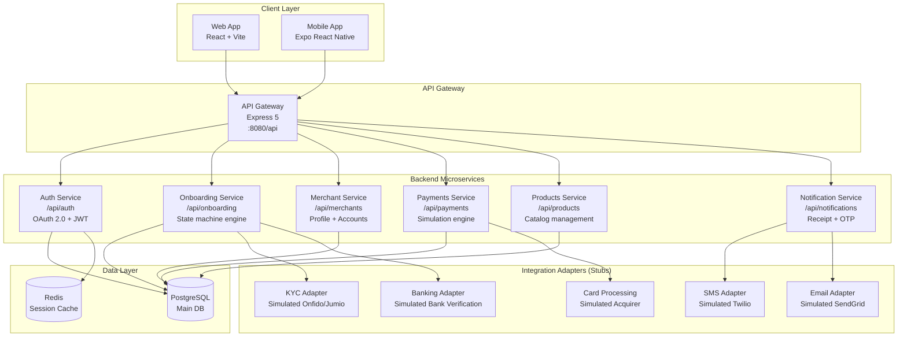
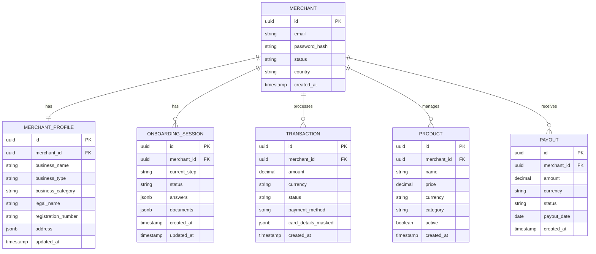
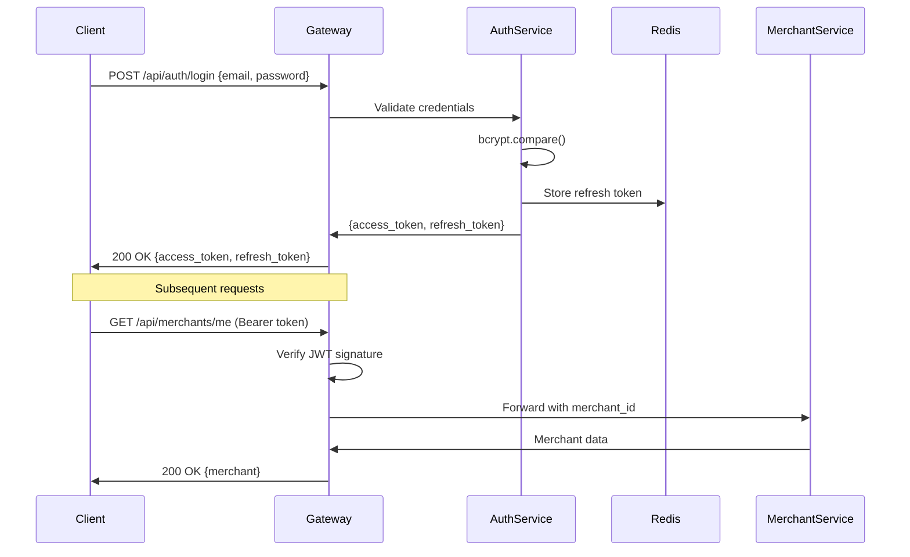
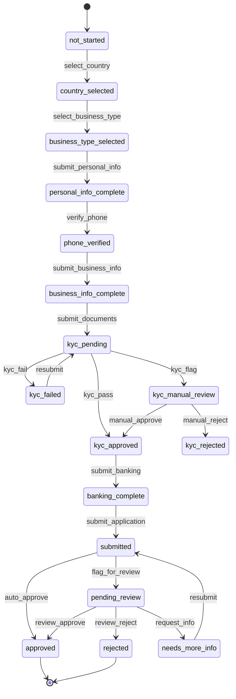

# System Architecture

## Overview

This is a SumUp-inspired multi-platform payments reference system. The architecture follows a microservices pattern with an API gateway, built to demonstrate how a modern mPOS platform could be structured.

All business logic is simulated/mocked — no real card processing, no real KYC provider.

---

## Architecture Diagram (Mermaid)

---

## Service Responsibilities

### API Gateway (Express 5)
- Route requests to appropriate microservice
- JWT validation middleware
- Rate limiting (configurable)
- Request logging (pino)
- CORS handling
- Health check endpoint

### Auth Service
- Merchant registration (email + password)
- Login (returns JWT access token + refresh token)
- Token refresh
- OAuth 2.0 flows (authorization code for third-party apps)
- Session management (Redis-backed)
- Staff account management

### Onboarding Service
- State machine engine for multi-step onboarding
- Country-aware question resolution
- Business type branching (individual/sole_trader/company)
- KYC/KYB orchestration via adapter
- Document upload handling
- Risk scoring (simulated)
- Status management (pending/approved/rejected/needs_info)

### Merchant Service
- Merchant profile CRUD
- Business profile management
- Account settings
- Multi-location support
- Staff/operator management

### Payments Service
- Simulated transaction processing
- Transaction history
- Refund management
- Checkout (payment link) creation
- Receipt generation
- Payout calculation (simulated)

### Products Service
- Product catalog CRUD
- Category management
- Price management
- Image handling (stub)

### Notification Service
- Email receipt delivery (stub)
- SMS OTP delivery (stub)
- Webhook dispatch (stub)
- In-app notification management

---

## Data Model (Simplified)

---

## Auth Flow

---

## Onboarding State Machine

---

## Technology Choices & Justifications

| Decision | Choice | Justification |
|---------|--------|---------------|
| Web framework | React + Vite | Fast dev experience; widely understood |
| Mobile | Expo (React Native) | Single codebase for iOS + Android |
| Backend | Express 5 + TypeScript | Team familiarity; fast iteration |
| Database | PostgreSQL + Drizzle ORM | ACID compliance required for financial data |
| Auth | JWT + refresh tokens | Stateless; works across web + mobile |
| API contract | OpenAPI 3.0 | Single source of truth; enables codegen |
| Validation | Zod | Runtime + compile-time safety |
| Monorepo | pnpm workspaces | Shared types; efficient builds |
| Containerization | Docker Compose | Local dev parity |
